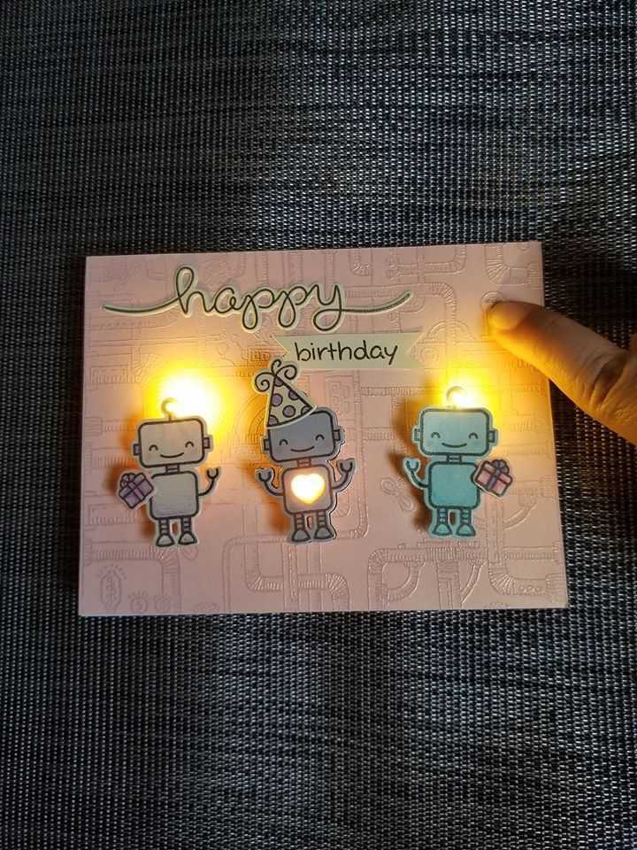

# GREETING LAMP 

## Aim

- [ ] To create a simple decorative sun model using coloured paper, an LED, and a coin-cell battery.

## Principle

* The project works on the principle of conversion of electrical energy into light energy. When current flows from the coin-cell battery through the LED, the LED produces light.

## Working

- The model is made in the shape of a sun using coloured paper.  
- A red LED is placed inside the paper structure to produce a glowing effect.  
- The LED is connected to a coin-cell battery.  
- When the LED terminals are connected correctly to the battery, current flows through the LED and it glows.  
- The paper around the LED diffuses the light and creates a bright sun-like appearance.

## Components Used

1. Red LED  
2. Coin-cell battery  
3. Coloured paper  
4. Cardboard/base  
5. Connecting wire/tape  
6. Glue  
7. Fossil

## Uses / Applications

💡 Decorative lighting model  
🎓 Simple electronics demonstration  
🔋 Demonstrates battery-powered circuits  
🔴 Demonstrates LED polarity and operation  
🌞 Can be used as a mini night-light concept  
🧑‍🏫 Useful for basic electronics exhibitions and craft projects

## CIRCUIT DIADRAM:  ![][image1]

- [ ] ### The coin-cell battery supplies electrical energy to the LED. When the circuit is connected properly, current flows through the LED and it glows. The LED converts the electrical energy from the battery into light energy. Thus, the simple circuit produces a glowing light effect.     

## RESULT:

* The project was successfully completed and tested. The red LED glowed using the coin battery, so the project worked successfully.

